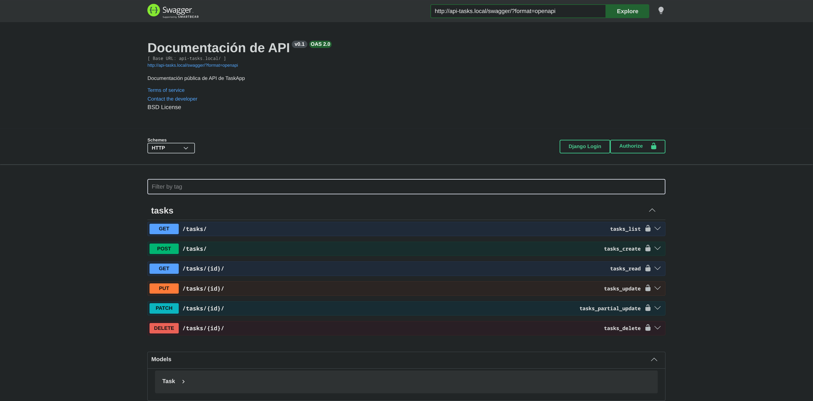

### ⚙️ Backend TodoApp - Django and DjangoRestFramework


# ⚙️ TodoApp - Backend API

API REST para la aplicación de tareas, construida con **Django** y **Django REST Framework (DRF)**.

## 🛠️ Tecnologías utilizadas

* Python
* Django & Django REST Framework
* PostgreSQL
* Docker,Docker Compose
* Swagger


## 🚀 Configuración en Local

Sigue estos pasos para levantar el entorno de desarrollo:

1. **Clona el repositorio:**

   ```bash
    git clone https://github.com/yclicourt/backend-tasks-app.git
    cd backend-tasks-app
   ```

2. **Crear y activar el entorno virtual**:

   ```bash
    python -m venv venv
    source venv/bin/activate  # En Linux/Mac
    # venv\Scripts\activate   # En Windows
   ```

3. **Instalar dependencias**:

   ```bash
    pip install -r requirements.txt
   ```

4. **Variables de Entorno**:
    ```bash
     DB_NAME=
     DB_USER=
     DB_PASSWORD=
     POSTGRES_USER=
     POSTGRES_PASSWORD=
     POSTGRES_DB=
     DB_HOST=
     DB_PORT=
     CORS_ALLOWED_ORIGINS=
     ALLOWED_HOSTS=
     DEBUG=
     SECRET_KEY=
    ``` 
    
5. **Ejecutar migraciones y arrancar el servidor**
    ```bash
     python manage.py migrate
     python manage.py runserver
   ```
6. **Ejecutar docker compose para levantar la base de datos o bien puede usar una base de datos con otro gestor**
   ```bash
     docker compose up -d
   ```
7. **Para crear la imagen docker**
   - Si se esta usando registry oficial(Docker Hub)
   
   ```bash
     docker build -t user/project:tag .
   ```

   - Si se esta usando un registry local(Harbor,Nexus)
   ```bash
     docker build -t harbor.local:backend-tasks-app/backend-tasks-app:latest .
     docker push harbor.local:backend-tasks-app/backend-tasks-app:latest
   ```
8. **Para ver la documentacion del backend**
   ```bash
     http://api-tasks.local/swagger/
     http://api-tasks.local/redoc/
     
   ```
   
   